# [🌹 틸리 - 꾸준하고픈 개발자를 위한 공간](https://kc29be941feb6a.user-app.krampoline.com/)

<p align='center'>
 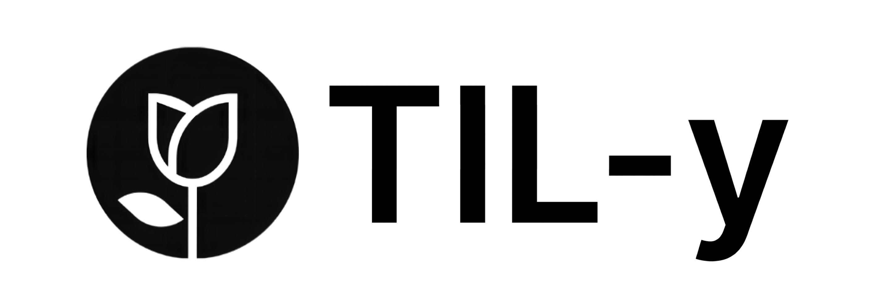
</p>
</br></br>
<p align='center'>
    
    
    
    
    
    
</p>
</br>

> **미리보기**
> - 💡 [서비스 기획 의도](#why-service)
> - 📌 [주요 기능](#main-function)
> - 💻 [BE - 핵심 개발 영역](#be-core)
> - 📝 [ERD](#erd)
> - 🔍 [아키텍쳐 구조](#architecture)
> - 🙇🏻‍♂️ [TIL-y 구성원](#til-members)
</br>


<h1 id="why-service">🤔 왜 이런 서비스를?</h1>

## 📍 문제 상황 인식 1단계 <카테캠 1,2 단계를 겪으며>
- 카테캠의 핵심, 자기주도적 학습 -> **매일, 매주 TIL 작성 및 제출**
- 하지만 100명이 넘는 학생들의 TIL을 **하나의 노션 페이지에서 일괄 관리**
<p align='center'>
    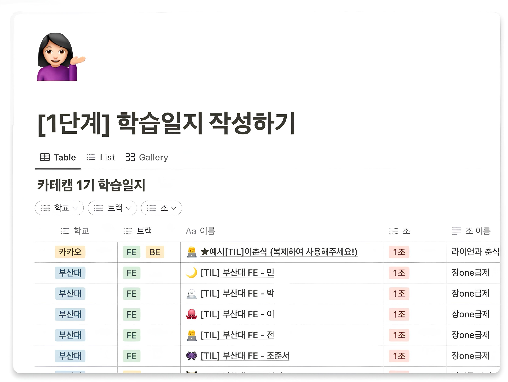
</p>

```
학생의 불편함 - 내 TIL이 삭제될 수 있고, 서로의 TIL이 모두 공개됨
멘토의 불편함 - 일일이 작성 여부를 확인해야 하고, 제출 여부 확인도 번거로움

-> 학습일지를 더 편하게 관리하고 제출할 수는 없을까?
```

### ⭐️ 문제 해결 방안 <그룹 로드맵 서비스>
- 로드맵을 만들어서 구성원들이 **참여**할 수 있게 하자
- 로드맵의 각 단계를 직접 설정하고, 구성원들이 **단계별**로 학습할 수 있도록 하자
- 제출 기한에 맞춰 각 단계별로 학습한 TIL을 제출할 수 있도록 하자
- 제출된 TIL은 한눈에 확인할 수 있게 하자
</br>

<p align='center'>
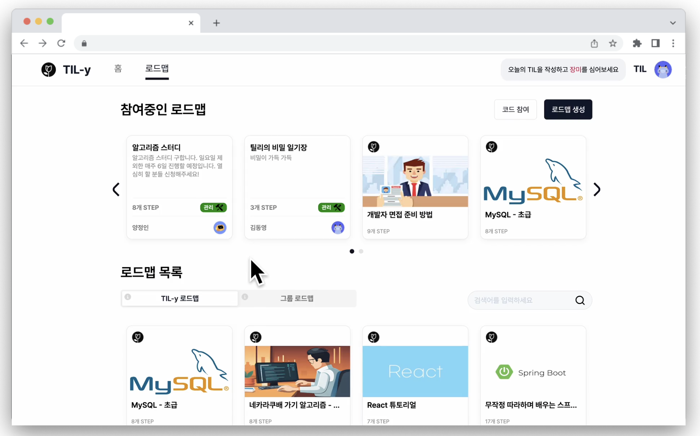
</p>

</br>

## 📍 문제 상황 인식 2단계 <자기주도적 개발 학습의 어려움>
- 개발, 기술 스택 공부는 스스로 시작해야하는 경우가 많음
```
하지만 어디서부터 어떤 순서로 학습해야 할지 막막함
내가 잘하고 있는지도 확인하기 어려움

-> 어떤 순서로 공부해야 할지, 또 잘하고 있는지 확인할 방법이 있을까?
```
### ⭐️ 문제 해결 방안 <로드맵 제공 및 TIL 공유>
- 스스로 학습할 수 있게 로드맵을 **제공**하자
- 단계별로 **참고 자료**를 제공하고, 학습 후 TIL을 제출할 수 있도록 하자
- 제출이 완료되면, 해당 학습 단계에 제출된 TIL을 모두 볼 수 있도록 하자
- 다른 사람들의 TIL을 참고하여, 본인의 학습이 잘 진행되고 있는지 **점검**할 수 있게 하자
</br> 

<p align='center'>
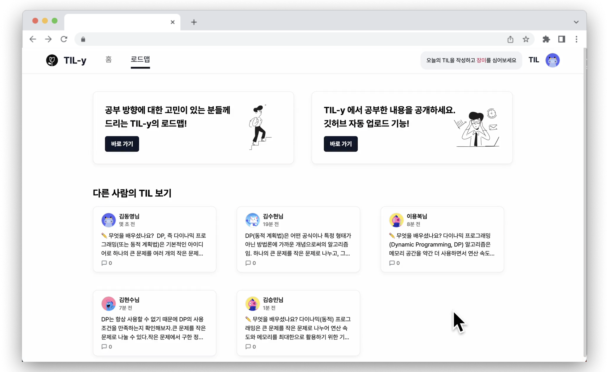
</p>

</br>
<h2 id="main-function">🧩 주요 기능</h2>

|TIL 작성|학습 참고|
|:--:|:--:|
|- 마크다운 에디터를 통해 TIL 작성<br/>- 자동 저장 기능으로 작성 도중 데이터 유실 방지<br/> |- 각 STEP별 참고자료 조회<br/>- 제출한 TIL에 달린 코멘트 확인 가능|
|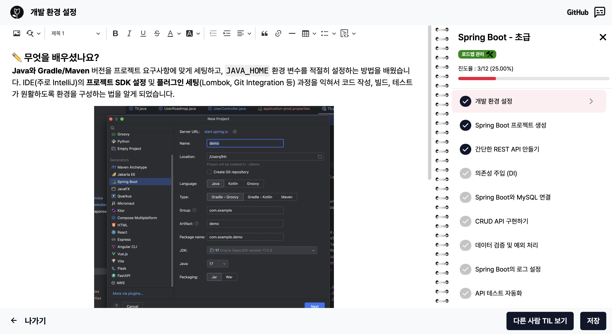|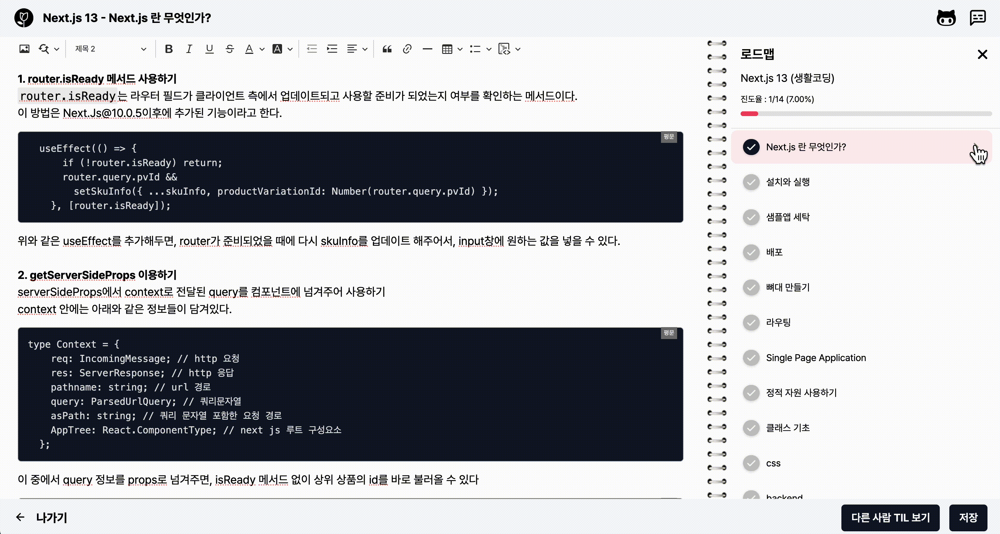|

|메인|참고 자료|
|:--:|:--:|
|- 작성한 TIL 목록을 검색하고 조회<br/>- 장미밭을 통해 학습 열정과 진행 상황 확인 <br/> - 개인과 그룹 로드맵을 구분하여 관리|- 로드맵에 외부 참고자료(URL, 유튜브) 첨부<br/> |
|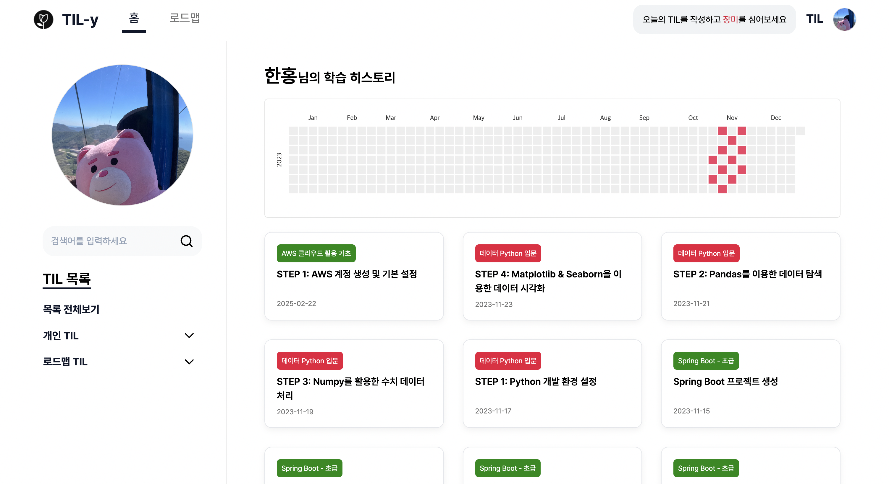|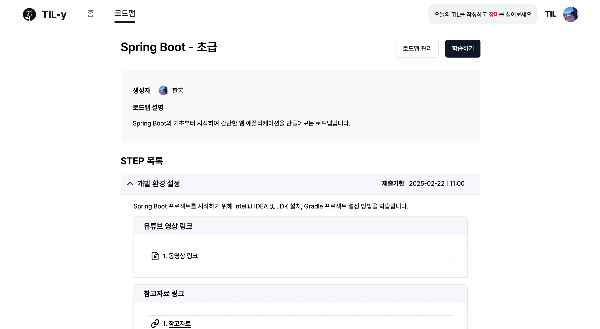|

|로드맵 목록|구성원 관리|
|:--:|:--:|
|- 내가 참여하고 있는 로드맵의 목록 확인<br/>- 현재 모집 중인 그룹 로드맵 목록 확인|- 로드맵에 속한 그룹원 목록 조회<br/>- 멤버 권한 변경 및 강퇴 처리와 로드맵 신청자 승인·거절 관리<br/> - 그룹원 TIL 작성 현황 확인<br/>|
|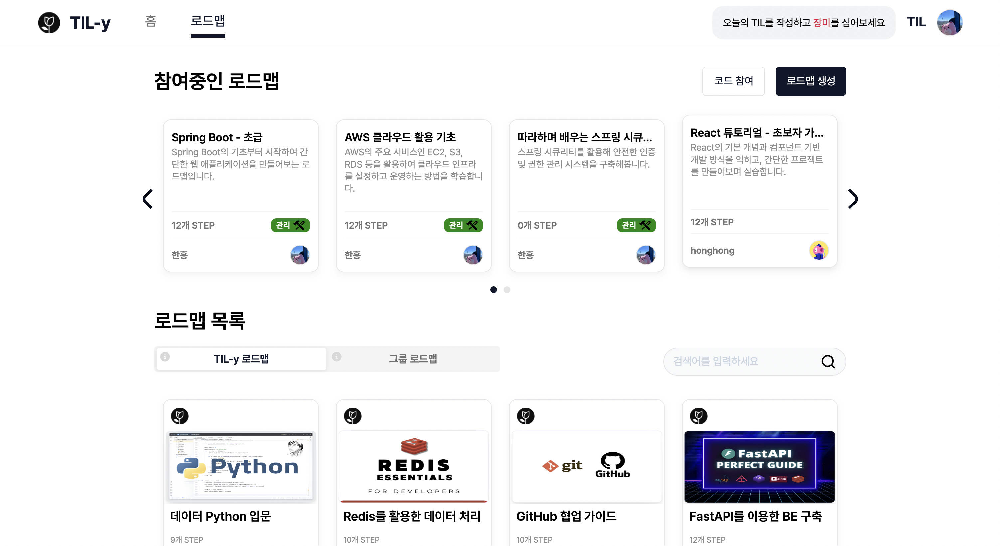|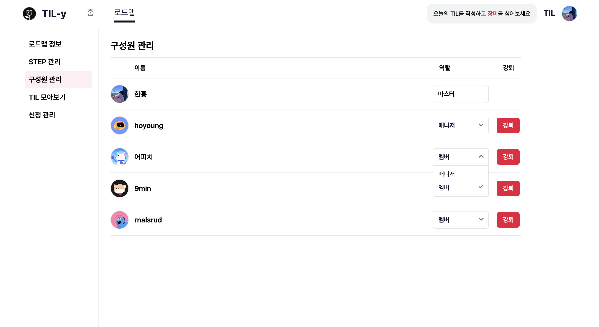|

|TIL 공유하기|깃허브 업로드|
|:--:|:--:|
|- 자신이 학습한 내용(TIL)을 타인과 공유<br/>- 다른 사람의 학습 방식을 참고하여 동기 부여|- 작성한 TIL을 깃허브에 업로드<br/> - 개인 깃허브 레포지토리에 학습 기록 보관
|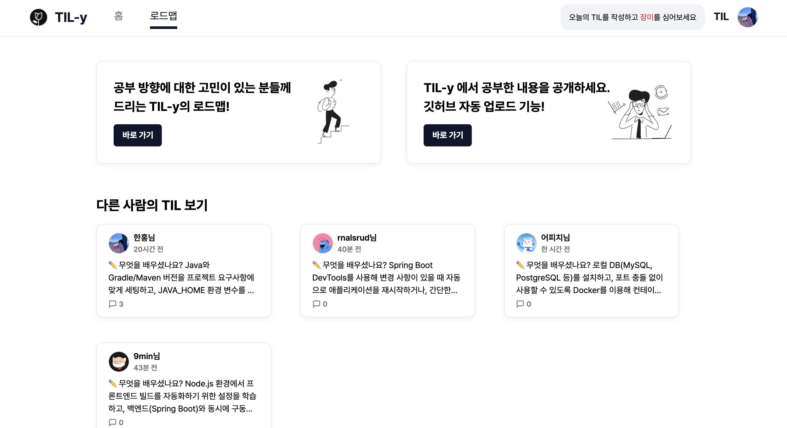|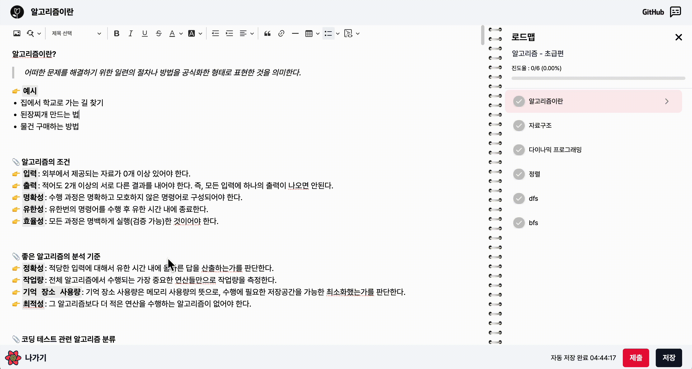|

</br>

<h2 id="be-core">🎯 BE - 핵심 개발 영역</h2>

|   기능   |                                                                                                                                       설명                                                                                                                                       |
|:--------:|------------------------------------------------------------------------------------------------------------------------------------------------------------------------------------------------------------------|
| 로그인/회원가입 | - JWT를 활용해 **인증 시스템** 구현<br>- 로그인 시 Access Token 발급, 만료 시 Refresh Token을 활용해 인증 상태 유지 |
|   검색 기능  | - 페이지별 검색 기능을 구현하여 TIL 제목, 특정 날짜, 로드맵 이름, 구성원 이름으로 데이터를 빠르게 **검색** 가능 |
| 이미지 업로드 | - AWS S3를 활용하여 프로필 사진과 TIL 이미지를 업로드하고, 삭제할 수 있는 기능 구현 |
|   알림 기능  | - 사용자가 제출한 TIL에 댓글이 달리면, 알림을 제공하는 기능 구현 |
|   댓글 기능  | - 제출된 TIL에 댓글을 작성하고, 수정 및 삭제할 수 있는 기능을 구현 |
|   삭제 기능  | - JPQL과 @Where을 활용하여 물리적 삭제 없이 **논리적 삭제** 구현<br>- 논리적 삭제를 통해 데이터 무결성을 유지하고, 삭제된 데이터의 이력 추적 및 활용 가능  |
| 예외 처리 | - **공통 예외 처리**를 통해 유지보수성 향상 및 중복 최소화 |
| 권한 처리 | - 로드맵 내 역할에 따른 권한 부여 및 **접근 제어** 구현 (Master, Manager, Member, None) |
| 테스트 코드 | - JUnit5를 활용해 **컨트롤러 단위테스트** 작성 |
| 성능 개선 | - Lazy Loading과 Fetch Join을 적절히 사용해 **N+1** 문제 해결<br>- 불필요한 의존성을 줄이기 위해 양방향보다 **단방향** 연관관계를 우선 적용 |
| 리팩토링 | - DTO를 class가 아닌 **record**로 선언하여 depth를 줄이고, 재사용성과 가독성 개선 |

</br>

<h2 id="erd">🏠 ERD</h2>
<p align='center'>
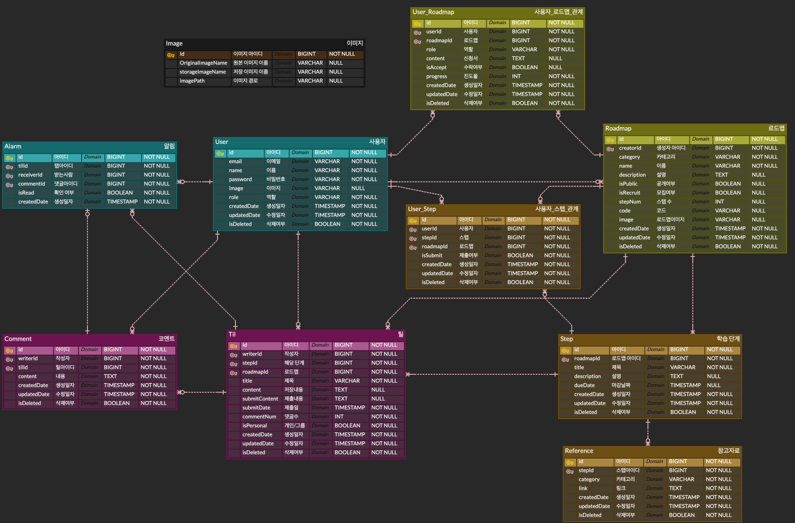
</p>

<br/>
 
<h2 id="architecture">⚙️ 아키택쳐 구조</h2>
<p align='center'>
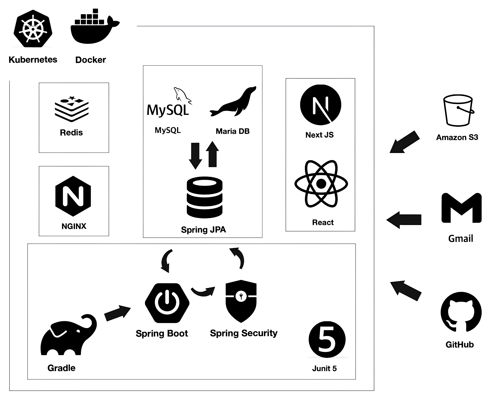
</p>
</br>

> - Redis를 이용해 Refresh Token을 **저장**하고 인증 시 유효성 검증 최적화.
> - Docker를 이용해 각 서비스(Spring, React, Redis, MariaDB)를 **모듈화**하고, 네트워크 설정과 종속성 관리 자동화
> - React(Next.js)와 Spring을 Nginx 리버스 프록시를 통해 연결하여 클라이언트와 서버사이드 요청을 동일한 API 엔드포인트로 **라우팅**
> - Next.js의 SSR을 활용해 클라이언트 렌더링 이전에 **접근 권한**을 제어하고, React-Query의 prefetch/Hydration으로 **초기 데이터 로딩** 최적화
</br>

<h2 id="demo"> 🎥 시연 영상</h2>

#### 📁 랜딩 페이지 → 회원가입 → 튜토리얼
https://github.com/user-attachments/assets/ce510cc0-ac15-47e5-9d82-a16a7efa39e5

</br>

#### 📁 메인 화면
https://github.com/user-attachments/assets/3936ebb1-0a03-4a4e-97f9-086c55d77fc1

</br>

#### 📁 TIL 작성하기
https://github.com/user-attachments/assets/3de8ed81-d4d4-46a8-b7b9-fd22daa90e66

</br>

#### 📁 로드맵 둘러보기 → 로드맵 관리
https://github.com/user-attachments/assets/caaf9fd2-ed16-4253-851b-49d65101f83c

</br>

<h2 id="refer"> 🔗 관련 주소</h2>

| 문서 | 
|:--------:|
| [API 문서](https://blog.naver.com/hoyai-/223220052770) |
| [피그마](https://www.figma.com/file/CBibyBNZ1jmESyVs0jnjSt/3%EB%8B%A8%EA%B3%84-%ED%94%84%EB%A1%9C%EC%A0%9D%ED%8A%B8-%EC%99%80%EC%9D%B4%EC%96%B4-%ED%94%84%EB%A0%88%EC%9E%84?type=design&node-id=0-1&mode=design&t=0h0155bB1sb2wp98-0) |

</br>

<h2 id="til-members">👨‍💻🧑‍💻 TIL-y 구성원</h2>
<table>
  <tr>
    <td>김동영</td>
    <td>조준서</td>
    <td>이한홍</td>
    <td>김수현</td>
    <td>이상명</td>
  </tr>
  <tr>
    <td></td>
    <td></td>
    <td></td>
    <td></td>
    <td></td>
  </tr>
  <tr>
    <td>FE</td>
    <td>FE</td>
    <td>BE</td>
    <td>BE</td>
    <td>BE</td>
  </tr>
  <tr>
    <td>조장</td>
    <td>테크리더</td>
    <td>기획리더</td>
    <td>스케줄러</td>
    <td>리마인더</td>
  </tr>
</table>
</br>
